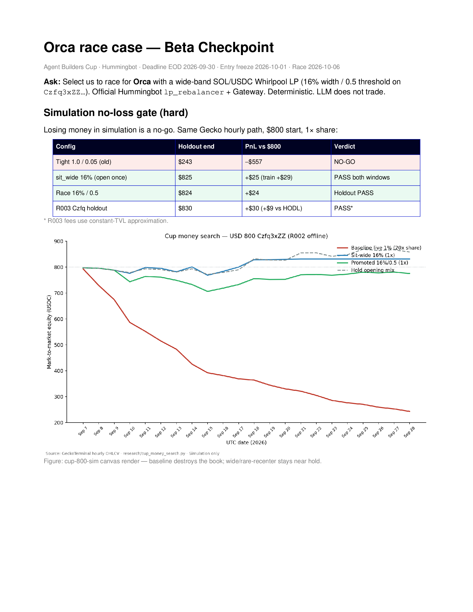

# Orca Tight-Range Leverage Farmer

**Subtitle (race entry, 2026-09):** *Wide-band SOL/USDC Whirlpool farmer — **16%** width / **0.5** rebalance threshold on `Czfq3xZZ…`.*

Agent Builders Cup entry for the **Orca** team. The product name above is unchanged for Botcamp continuity; the **executable policy is no longer a ±1.5% churn band**. Offline no-loss sims rejected the tight band and promoted a wide, rarely recentered range (see below).

Official Botcamp timeline (2026): registration / application through **Sep 30**; refine until finals; finals start **Oct 1**; race **Oct 6**. Scoring: Volume 40% / P&L 40% / HBOT Vote 20%. Volume = **fees-implied** traded volume (not our own open/close swaps).

Live path: **Hummingbot `lp_rebalancer` + Gateway `orca/clmm`** (pinned 2.17). Condor is UI / narration only — LLM must not place or cancel LP. Install: [`docs/INSTALL_PLAN.md`](docs/INSTALL_PLAN.md). Ops: [`docs/MAINNET_OPS.md`](docs/MAINNET_OPS.md).

## Why the algo changed (tight → wide)

Early Cup drafts sold “tight-range leverage” (±1–2% bands, frequent recenter). Mainnet smoke + a full Gecko hourly grid on $800 / 1× share showed that **tightening a CLMM band scales fees and loss-versus-rebalancing together** — not free leverage.

| Config | Holdout end | PnL vs $800 | Verdict |
|--------|------------:|------------:|---------|
| Old tight **1.0 / 0.05** | $243 | **−$557** | **NO-GO** (1,224 rebals) |
| **sit_wide 16%** | $825 | **+$25** (train +$29) | **PASS** both windows |
| Race **16% / 0.5** | $824 | **+$24** | Holdout PASS (~1 rebal) |

Full pack: [`submission/simulations/`](submission/simulations/) · race case: [`submission/orca_race_case/`](submission/orca_race_case/).

[Loom Video Explainer](https://www.loom.com/share/978ba7b355f3452786cca4bf787ef02a)

### Simulation chart (R002 cup money search)



*Figure: same Gecko hourly path. Red = old 1% live-style band; blue/green = sit-wide 16% and race 16%/0.5. Source: `research/cup_money_search.py`. Constant-TVL napkin caveat on R003 fees.*

PDF decks: [`submission/orca_race_case/pdf/orca-race-case.pdf`](submission/orca_race_case/pdf/orca-race-case.pdf) · [`submission/orca_race_case/pdf/cup-800-sim.pdf`](submission/orca_race_case/pdf/cup-800-sim.pdf).

## What the agent does (now)

One concentrated SOL/USDC position on Orca Whirlpool `Czfq3xZZDmsdGdUyrNLtRhGc47cXcZtLG4crryfu44zE` (0.04%; only true SOL-USDC tier clearing TVL ≥ $500k for an $800 deposit in R003).

1. Open a **16%** RANGE around spot (`autoswap` on).
2. Hold while in-band (collect fees → Volume).
3. Close/reopen only if spot moves **> 0.5%** past the band edge.
4. Unattended health: LaunchAgent watchdog (sticky LP + on-chain flat confirm) + reporter.

```
Gecko / grid sims  -->  race YAML (16 / 0.5)  -->  lp_rebalancer  -->  LPExecutor  -->  Gateway / Orca
     (offline gate)         configs/…_race_800.yml      (official)      (deterministic)
```

Research `decide()` still lives in [`src/orca_tight_range/logic.py`](src/orca_tight_range/logic.py); the **race runner** is official `lp_rebalancer` with those widths — not a second forked policy.

## Application checklist (through EOD 2026-09-30)

1. Register / apply to **Orca**: [Agent Builders Cup](https://www.botcamp.xyz/hackathons/agent-builders-cup-1).
2. Edit Botcamp strategy — paste [`submission/FORM_PASTE.md`](submission/FORM_PASTE.md) / [`submission/APPLICATION.md`](submission/APPLICATION.md).
3. Attach this repo as **Code Files** (or zip), including:
   - [`submission/simulations/`](submission/simulations/)
   - [`configs/lp_rebalancer_race_800.yml`](configs/lp_rebalancer_race_800.yml) + [`configs/lp_rebalancer_r003m_100.yml`](configs/lp_rebalancer_r003m_100.yml)
   - [`submission/strategy.md`](submission/strategy.md)
   - [`submission/orca_race_case/`](submission/orca_race_case/) (images, PDFs, collateral)
4. Record the demo with [`submission/VIDEO_SCRIPT_WIDE_BAND.md`](submission/VIDEO_SCRIPT_WIDE_BAND.md) (replaces the old ±1.5% Loom script).
5. Checklist: [`docs/SUBMISSION_CHECKLIST.md`](docs/SUBMISSION_CHECKLIST.md).

## Live proof (honest)

Trial **R003m**: ~$100 quote, **16% / 0.5**, same pool — race-shaped smoke before Botcamp $800. Ledger: [`docs/TRIALS_LEDGER.md`](docs/TRIALS_LEDGER.md). **No unfinished-clock P&L claims.** Tight-band T016 was cancelled after the sim gate.

## Repo map

| Path | Role |
|------|------|
| [`submission/orca_race_case/`](submission/orca_race_case/) | Beta-checkpoint collateral: sims images, PDFs, APPLICATION |
| [`submission/simulations/`](submission/simulations/) | No-loss gate JSON + `SIMULATION_RESULTS.md` |
| [`submission/FORM_PASTE.md`](submission/FORM_PASTE.md) | Botcamp field paste (strategy 156) |
| [`submission/VIDEO_SCRIPT_WIDE_BAND.md`](submission/VIDEO_SCRIPT_WIDE_BAND.md) | Loom shot list for the wide-band thesis |
| [`docs/MAINNET_OPS.md`](docs/MAINNET_OPS.md) | Watchdog / recycle / RPC notes |
| [`docs/INSTALL_PLAN.md`](docs/INSTALL_PLAN.md) | Condor + Gateway Docker |
| [`docs/LEGAL_VENUE_GATE.md`](docs/LEGAL_VENUE_GATE.md) | Orca only (US ToS) |
| [`src/orca_tight_range/`](src/orca_tight_range/) | Policy + pool rank (unit-tested) |
| [`configs/lp_rebalancer_race_800.yml`](configs/lp_rebalancer_race_800.yml) | Race book ($800) |
| [`configs/lp_rebalancer_r003m_100.yml`](configs/lp_rebalancer_r003m_100.yml) | Live proof ($100) |

## Local smoke (no Docker)

```bash
cd ~/proj/hummingbot-hackathon
python3 -m pip install -r requirements.txt
python3 -m pytest tests/ -q
python3 research/cup_money_search.py          # R002 grid / curves
python3 research/r003_multi_pool_replay.py    # true SOL-USDC tiers
```

## Official sources

- Rules: https://www.botcamp.xyz/hackathons/agent-builders-cup-1/resources
- Orca connector: https://hummingbot.org/exchanges/gateway/orca/
- LP executor: https://hummingbot.org/strategies/v2-strategies/executors/
- This repo: https://github.com/ajjcoppola/hummingbot-hackathon
