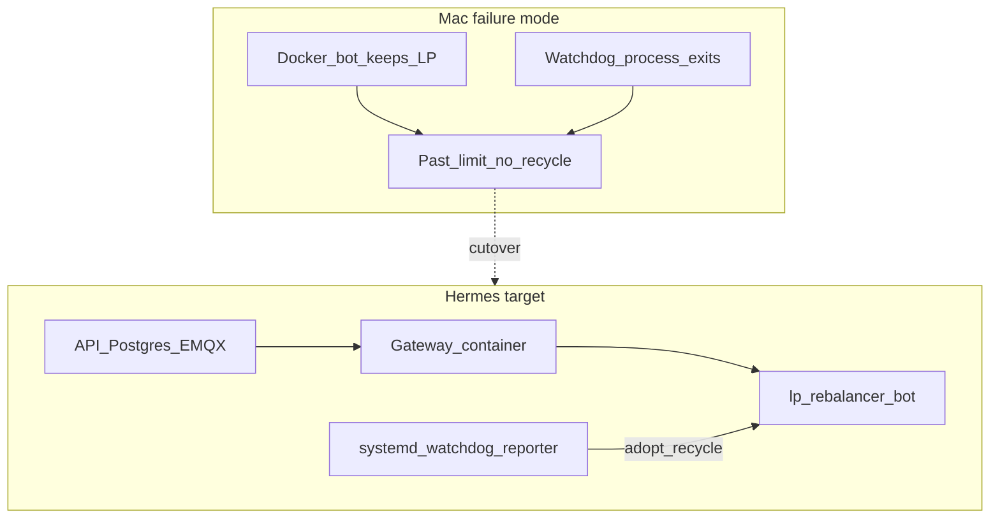

# DEFERRED — future-plans (Cup window)

Shelved 2026-09-26. Near-term path: Mac Amphetamine + LaunchAgents + HB 2.17 (see active Mac 48h plan).
Do not execute until after Cup finals unless Mac durability fails.

Original Cursor plan: `~/.cursor/plans/hermes_watchdog_port_472eab12.plan.md`

---

# Sherlock: Watchdog durability via Hermes (DO droplet)

**Console:** [DigitalOcean droplet 573600155](https://cloud.digitalocean.com/droplets/573600155?i=3d53e4)

**Default cutover:** install + smoke on hermes first; migrate live mainnet LP only after `status` PASS on the VPS; then stop Mac LaunchAgent/bot so capital has one owner.

---

## Sherlock Steps 1–2 (reflect → distill)

**Possible sources (cast wide):**
1. Watchdog started as `python … &` / agent-shell child → dies on session teardown
2. No true supervisor (LaunchAgent added late; still Mac-login-scoped)
3. Mac sleep / App Nap pausing host Python (reporter survived last night → weak for *this* incident)
4. Uncaught crash (no `action:error` in jsonl → weak)
5. Ops restart churn during recycle killed the process and nobody relaunched it
6. Hardcoded Homebrew/`/Users/ajjc` paths fragile across restarts
7. Watchdog co-located with laptop lifecycle (lid, logout, Cursor) while Docker bots keep running

**Most likely (ranked):**
1. **Process supervision gap** — safety net is not OS-managed like Docker bots; dies silently while LP stays open
2. **Laptop = wrong host for unattended race** — Mac GUI session ≠ 24/7 control plane
3. **Secondary:** Mac-only LaunchAgent still tied to logged-in user / path assumptions

**Evidence already in hand:** reporter wrote continuously overnight; watchdog jsonl silent ~21h after `2026-09-25T18:45Z`; prior note “watchdog had died overnight”; official bot can strand past-limit without recycle.

---

## Target architecture (hermes)

| Layer | On hermes | Supervisor |
|-------|-----------|------------|
| Hummingbot API + Postgres + EMQX | Docker Compose (upstream deploy) | `docker compose` / restart policy |
| Gateway | API `POST /gateway/start` image | Docker |
| Bot `orca_tight_mainnet_smoke*` | API via docker.sock | Docker |
| Condor | host Python + tmux **or** systemd user service | systemd/tmux |
| Repo ops (`mainnet_bot_ops`, reporter, watchdog) | clone `hummingbot-hackathon` | **systemd units KeepAlive** |
| Access | SSH + Tailscale; API/Gateway **loopback or Tailscale only** | DO firewall deny public `:8000`/`:15888` |

Policy stays in this repo; stack sibling dir e.g. `/opt/hummingbot-v216` (not `~/proj/hummingbot` 2024). LLM / Condor `/agent` still must not place LP.

---

## Deliverables (this repo)

1. **[`scripts/hermes/install_stack.sh`](scripts/hermes/install_stack.sh)** — Linux one-shot (Ubuntu assumed):
   - Install Docker Engine + compose plugin, Python 3, git
   - Create `/opt/hummingbot-v216`, run upstream `hummingbot/deploy` `setup.sh` non-interactive where possible (or document the 3 prompts: Telegram token, user id, API yes, **Tailscale yes**)
   - Clone/pull `hummingbot-hackathon` to `/opt/hummingbot-hackathon`
   - Copy controller YAML from repo → `hummingbot-api/bots/conf/controllers/orca_tight_mainnet_smoke.yml` (threshold `0.05`, width `1.0` as live today)
   - Write env templates under `scripts/hermes/env.example` (no secrets committed)
   - Install systemd units (below)
   - Print DO console checklist + `ufw`/DO firewall rules

2. **Systemd units** (replace Mac LaunchAgent):
   - [`scripts/hermes/systemd/hummingbot-mainnet-watchdog.service`](scripts/hermes/systemd/hummingbot-mainnet-watchdog.service) — `Restart=always`, runs [`scripts/launch_mainnet_watchdog.sh`](scripts/launch_mainnet_watchdog.sh) with Linux `python3` (drop `/opt/homebrew` hardcode; use `env python3` or `/usr/bin/python3`)
   - [`scripts/hermes/systemd/hummingbot-mainnet-reporter.service`](scripts/hermes/systemd/hummingbot-mainnet-reporter.service) — T013 (or active run-id via env)
   - Optional: `hummingbot-condor.service` wrapping Condor start

3. **Docs**
   - New [`docs/HERMES_DEPLOY.md`](docs/HERMES_DEPLOY.md): droplet link, Tailscale, secrets migration, cutover/rollback, “never public API”
   - Patch [`docs/MAINNET_OPS.md`](docs/MAINNET_OPS.md): primary watchdog path = hermes systemd; Mac LaunchAgent = laptop-only fallback
   - Ledger note in [`docs/TRIALS_LEDGER.md`](docs/TRIALS_LEDGER.md) when cutover happens (new trial id if LP recycled onto hermes-managed bot)

4. **Path/env fixes** so scripts are VPS-safe:
   - Parameterize `ROOT` / `HB_API_URL` (default `http://127.0.0.1:8000` on hermes)
   - `BOTS_PATH` absolute Linux path in API `.env`
   - Helius RPC apply via existing `scripts/apply_helius_rpc.py` on hermes Gateway conf (key via env, never git)

---

## Cutover sequence (operator)

1. **Prep droplet** from DO console: Ubuntu LTS, SSH key, enable monitoring; size ≥4 GB RAM (8 GB preferred per INSTALL_PLAN).
2. **Tailscale** on hermes + laptop; confirm API only on Tailscale/loopback.
3. Run `install_stack.sh` on hermes; start Gateway; import **same** Solana wallet via Condor (base58 once; do not commit).
4. Sync live YAML; `python3 scripts/mainnet_bot_ops.py status` on hermes → expect empty or adopt path.
5. **Mac drain:** if Mac still holds the one LP, either (a) stop Mac bot + `adopt` from hermes after pointing Gateway at same wallet (one network owner), or (b) `adopt --recycle` from Mac then immediately deploy from hermes — prefer (a) if Gateway state can be migrated via `gateway-files` copy to avoid an extra close. **Chosen default:** copy `gateway-files` + `.env` secrets over Tailscale/SSH, stop Mac containers, start hermes Gateway+bot with `adopt` (keep LP) if position already open; recycle only if adopt fails.
6. Enable systemd watchdog+reporter; confirm `watchdog.jsonl` advances every ~120s for ≥30 min.
7. Disable Mac LaunchAgent (`launchctl bootout …`) and Mac reporter so only hermes supervises.
8. Smoke: force mild health check; document past-limit recycle still works on Linux.

**Rollback:** re-enable Mac LaunchAgent + local compose; stop hermes bot; `adopt` on Mac if LP still open.

---

## Sherlock Step 5 — monitoring (post-port)

- Alert if `watchdog.jsonl` mtime > 10 min (cron or systemd `WatchdogSec` + `OnFailure=` mail/Telegram)
- Morning canvas / Automation retarget: SSH/Tailscale to hermes or `HB_API_URL` over Tailscale (cloud Automations cannot see Mac localhost; hermes Tailscale URL is the durable fix for morning reports too)
- Do **not** open DO public ports for API/Gateway

---

## Out of scope (this plan)

- Scaling to $800 Cup size
- Promoting custom `orca_tight_range` controller
- Editing the attached “Fix managed rebalance” plan file
- Committing wallet keys or `.env`

---

## Success criteria

- Hermes: one running bot, one LP, `status` PASS
- `systemctl is-active hummingbot-mainnet-watchdog` = active; jsonl continuous across SSH disconnect / laptop sleep
- Mac no longer required for recycle; overnight past-limit stranding cannot be caused by lid-close or Cursor session end
